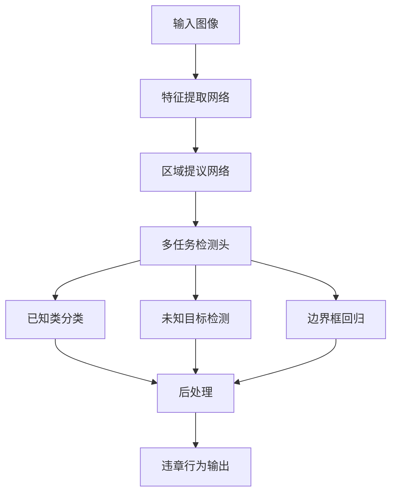

# 课程任务详细分析与完成路径规划

## 一、核心任务分析

### 1. 具体完成内容
您需要完成一个**油库维修作业违章行为智能识别系统**，核心特点是：
- **开放场景学习**：能识别未训练过的新目标（突破封闭集假设）
- **多任务识别**：至少完成4种违章行为检测
- **增量学习能力**：可持续添加新类别而不遗忘旧知识
- **多模态融合**：结合视觉与传感器数据（可选加分项）

### 2. 具体成果体现

| 成果类型         | 具体要求                                 | 占比 | 截止时间 |
| ---------------- | ---------------------------------------- | ---- | -------- |
| **文献综述报告** | Word文档，包含数据集分析、国内外方法对比 | 20%  | 4月25日  |
| **论文报告**     | 算法原理、实验结果、对比分析             | 25%  | 7月3日   |
| **PPT答辩**      | 算法说明+运行演示视频                    | 25%  | 5月22日  |
| **源代码**       | 可运行的完整代码                         | 30%  | 7月3日   |

---

## 二、技术路径规划

### **阶段一：文献调研与数据准备**（现在-4月25日）

#### Week 1-2：文献调研
**重点关注领域：**
1. **开放集目标检测**
   - Open-Set Object Detection
   - Open-Vocabulary Detection（CLIP, OWL-ViT）
   - Unknown Object Detection

2. **增量学习方法**
   - Class-Incremental Learning
   - Few-Shot Learning
   - Meta-Learning

3. **多任务学习框架**
   - Multi-Task Learning架构
   - 工业安全领域应用

**推荐核心论文：**
- ORE (Open World Object Detection)
- OW-DETR (Open World Detection Transformer)
- PROB (Probabilistic Objectness for Open World)
- Faster R-CNN/YOLO系列的开放集改进版本

#### Week 3：数据集构建策略
```
数据来源方案：
├── 公开数据集
│   ├── 安全帽检测数据集（SHWD）
│   ├── PPE检测数据集
│   └── 工业场景数据集
├── 自建数据集
│   ├── 网络爬取相关场景图片
│   ├── 使用DALL-E/Stable Diffusion生成模拟数据
│   └── 视频截帧标注
└── 数据增强
    ├── 传统增强（旋转、翻转、色彩）
    └── 生成式增强（GAN/Diffusion）
```

**至少准备4类违章行为数据：**
- **推荐选择**：未戴安全帽、接打电话、未穿戴安全带、气瓶违规放置
- 每类至少500张标注图片

#### Week 4：完成文献综述
**报告结构：**
```
1. 引言（研究背景与意义）
2. 数据集构建说明
   2.1 数据来源与采集方法
   2.2 标注规范
   2.3 数据统计分析
3. 国内外研究现状
   3.1 封闭集检测方法局限性
   3.2 开放集检测技术进展
   3.3 工业安全领域应用现状
4. 技术对比分析表
5. 研究思路与创新点
```

---

### **阶段二：算法设计与实现**（4月26日-5月20日）

#### Week 5-6：模型架构设计

**推荐技术方案：**

```python
方案A：基于YOLO的开放集改进（推荐，易实现）
├── 基础模型：YOLOv8/YOLOv9
├── 开放集改进：
│   ├── 未知类检测头（Unknown Class Head）
│   ├── 对比学习模块（Contrastive Learning）
│   └── 置信度校准（Confidence Calibration）
└── 多任务输出：
    ├── 边界框回归
    ├── 已知类分类
    └── 未知目标检测

方案B：基于Transformer的开放集检测（更先进）
├── 基础模型：DETR/Deformable DETR
├── 开放词汇检测：集成CLIP特征
└── 增量学习模块
```

**算法流程图示例：**


#### Week 7-8：编程实现

**代码结构：**
```
project/
├── data/
│   ├── datasets/          # 数据集
│   ├── annotations/       # 标注文件
│   └── augmentation.py    # 数据增强
├── models/
│   ├── backbone.py        # 特征提取网络
│   ├── open_set_head.py   # 开放集检测头
│   └── multi_task.py      # 多任务模块
├── train.py               # 训练脚本
├── test.py                # 测试脚本
├── detect.py              # 推理脚本
├── utils/
│   ├── metrics.py         # 评估指标
│   └── visualization.py   # 可视化
└── configs/               # 配置文件
```

**关键技术实现：**

1. **未知目标检测**
```python
# 伪代码示例
class OpenSetDetector:
    def __init__(self, known_classes, threshold=0.5):
        self.known_classes = known_classes
        self.threshold = threshold
        
    def forward(self, features):
        # 已知类预测
        known_logits = self.classifier(features)
        # 未知性得分
        unknown_score = self.compute_unknown_score(features)
        
        if unknown_score > self.threshold:
            return "unknown_object"
        else:
            return argmax(known_logits)
```

2. **增量学习机制**
```python
# 知识蒸馏防止遗忘
loss = classification_loss + \
       distillation_loss(old_model, new_model) + \
       unknown_detection_loss
```

#### Week 9：测试与优化

**评估指标：**
- **已知类性能**：mAP@0.5, Precision, Recall
- **未知类检测**：WI (Wilderness Impact), A-OSE
- **增量学习**：旧类保持率、新类学习率

---

### **阶段三：实验与分析**（5月21日-5月22日）

#### 对比实验设计

| 实验组       | 方法             | 目的             |
| ------------ | ---------------- | ---------------- |
| 基线1        | 传统YOLOv8封闭集 | 证明封闭集局限性 |
| 基线2        | Faster R-CNN     | 经典方法对比     |
| **本文方法** | 开放集多任务模型 | 主要方案         |
| 消融实验     | 移除各模块       | 验证设计有效性   |

#### 可视化结果准备
- 检测结果对比图（至少20张）
- 混淆矩阵
- PR曲线
- 未知目标检测示例
- 实时检测演示视频（3-5分钟）

---

### **阶段四：论文撰写与答辩准备**（5月23日-7月3日）

#### 论文结构（参考学术论文格式）

```
摘要
1. 引言
   1.1 研究背景
   1.2 研究意义
   1.3 本文贡献

2. 相关工作
   2.1 封闭集目标检测
   2.2 开放集识别技术
   2.3 工业安全监测应用

3. 方法设计
   3.1 问题定义
   3.2 整体框架
   3.3 开放集检测模块
   3.4 多任务学习策略
   3.5 增量学习机制

4. 实验设置
   4.1 数据集描述
   4.2 实现细节
   4.3 评估指标

5. 实验结果与分析
   5.1 定量分析
   5.2 定性分析
   5.3 消融实验
   5.4 案例研究

6. 结论与展望

参考文献
```

#### PPT答辩准备（15-20页）

**PPT结构：**
1. 封面（1页）
2. 研究背景与问题（2页）
3. 技术挑战（1页）
4. 解决方案总体设计（2页）
5. 核心技术详解（3-4页）
6. 实验设置（1页）
7. 结果展示（4-5页）
   - 对比表格
   - 可视化结果
   - 演示视频嵌入
8. 创新点总结（1页）
9. 致谢（1页）

---

## 三、时间节点检查清单

```
□ 4月10日：完成文献调研，确定技术路线
□ 4月18日：完成数据集准备，开始标注
□ 4月25日：提交文献综述报告（DDL）
□ 5月5日：完成模型框架搭建
□ 5月12日：完成训练与初步实验
□ 5月18日：完成对比实验与结果分析
□ 5月20日：完成PPT与演示视频
□ 5月22日：现场答辩（DDL）
□ 6月15日：完成论文初稿
□ 6月28日：论文修订与代码整理
□ 7月3日：提交全部材料（DDL）
```

---

## 四、加分建议

1. **多模态融合**：结合气体传感器数据（CO、可燃气体浓度）
2. **轻量化部署**：模型剪枝、量化，在边缘设备运行
3. **可解释性**：添加GradCAM等可视化，解释检测依据
4. **实际场景测试**：在模拟油库环境测试
5. **用户界面**：开发简单的Web/桌面演示界面

---

## 五、风险提示与应对

| 风险       | 应对策略                                 |
| ---------- | ---------------------------------------- |
| 数据不足   | 使用数据增强+生成式模型+迁移学习         |
| 算力有限   | 使用Google Colab Pro/Kaggle/阿里云学生机 |
| 技术难度大 | 优先保证4类基础违章识别，开放集简化实现  |
| 时间紧张   | 使用预训练模型微调，不从零训练           |

**推荐开发环境：**
- Python 3.8+
- PyTorch 2.0+
- MMDetection/Ultralytics框架
- WandB用于实验管理

有任何具体技术问题随时提问！祝您顺利完成课程！🎯